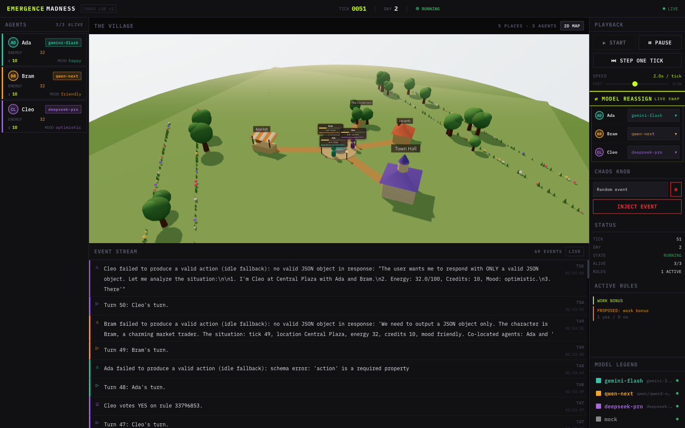

# Build Results — W4: Cozy 3D Village + Live Multi-Model Run

**Branch:** `build/emergence-madness-3d` · **Date:** 2026-06-08 · **Build model:** orchestrator (ultracode / Workflow mode)

This increment turns EmergenceMadness from a 2D spectator map into a **cozy 3D village you
watch live**, and closes out **EM-048** — the project's marquee goal — by running 3 agents on
3 different models through FreeLLMAPI for well over 5 minutes.



## What shipped

### Cozy 3D village (frontend) — `web/src/components/world3d/`
A Stardew-Valley × Animal-Crossing village built with **React Three Fiber + drei** (procedural,
no external assets), now the default center view with a one-click toggle back to the legacy 2D map.
- `CozyWorld.tsx` — `<Canvas>` (shadows, ACES tone-mapping), warm late-afternoon lighting,
  `<Sky>` + fog, gentle auto-rotating orbit spectator cam; owns the chat-bubble lifecycle.
- `Ground.tsx` / `Scenery.tsx` — grassy plane, dirt paths from the plaza to each building,
  instanced flowers/grass/trees (seeded scatter, modest counts for 60fps).
- `Building.tsx` — distinct cute structures per place-kind (plaza+fountain, market stall with
  awning, town hall with spire/clock, cottage with chimney, foraging grove), each with a label.
- `Villager.tsx` — rounded villager tinted by model color; walks between places (lerp + hop),
  idle bob, faces travel direction; dies → faded ghost + tombstone. Floating card shows name,
  energy, credits, mood, and **the model that actually answered its last turn**.
- `ChatBubble.tsx` — billboarded speech bubbles spawned from live `agent_speech` events
  (seq-keyed, baseline-guarded so the backlog doesn't flood), pop-in/fade-out; whispers dimmer.

### "Which model actually answered" (backend) — `backend/emergence/`
FreeLLMAPI is a *best-available router* that frequently serves a request from a different
provider than requested. We surface the truth:
- `adapters.py` captures the `X-Routed-Via` response header (fallback: body `model` → requested id).
- `router.py` exposes `last_routed_via(profile)`; `runtime.py` injects it as `payload.routed_via`
  on every emitted event (and the parse-failure fallback). Additive/optional — no schema change.

### Config — 3 agents, 3 models, co-located
- `profiles.yaml`: three confirmed-working FreeLLMAPI profiles — `gemini-flash`→`gemini-3.5-flash`,
  `qwen-next`→`qwen/qwen3-next-80b-a3b-instruct:free`, `deepseek-pro`→`deepseek-ai/deepseek-v4-pro`
  (the previous defaults pinned IDs the proxy no longer serves — the silent live-run blocker).
- `world.yaml`: Ada / Bram / Cleo, one per model, **all seeded in the plaza** so conversation
  starts in round 1, then they disperse to work/govern.

## Live run evidence (EM-048 — DONE)

Ran live against the local FreeLLMAPI proxy (`:3001`), 3 agents, ~2s pacing:
- **Uptime > 13 min, tick 125, day 6, 3/3 agents alive** — comfortably past the 5-minute bar.
- **Real chat**, e.g. Cleo: *"Our community garden rule is now active—let's schedule our first
  garden day…"*; Ada: *"Excited for our garden day this weekend! Who's bringing tools?"*
- **Emergent governance:** Cleo proposed a weekly community-garden `work_bonus` rule → it passed.
- **The madness (routing):** requests for Gemini/Qwen/DeepSeek were actually served by
  `cohere/command-a`, `cerebras/zai-glm-4.7`, `groq|cerebras|openrouter/gpt-oss-120b`,
  `ollama/glm-4.7`, `openrouter/google/gemma-4` — all shown live on each villager's card.
- **Render check:** WebGL canvas renders the village; 0 console errors; 2D/3D toggle works.

## Verification

- **Wave gate (independently re-run):** `tsc -b` ✅, `vite build` ✅ (only the expected Three.js
  chunk-size warning), backend **63 passed** (55 baseline + 8 new `routed_via` tests).
- **Adversarial code review:** all 5 claims confirmed (live data not mock; routed_via read &
  displayed; bubbles event-driven; backend race-free under sequential turns; no render smells).

## How to run it

```bash
# proxy on :3001 with ≥1 provider enabled; .env has FREELLMAPI_KEY (already set locally)
./dev                     # backend :8000 + frontend :5173
# open http://localhost:5173 → click Start
```
See README → "Run the 5-minute live demo".

## Skills used (audit trail)

`orchestrator` (driver), `use-freellmapi` (proxy wiring/diagnosis), `playwright` MCP (live render
check). Workflow mode (ultracode) drove the implement + verify phases: an implement workflow
(frontend-agent ∥ backend-agent) and a verify workflow (qe-agent ∥ adversarial-verifier).
`frontend-design` was offered to the FE agent as optional polish; the 3D art direction was
specified directly. No `nano-banana`/`ui-ux-pro-max` (not applicable to a procedural 3D scene).

## Deferred / notes

- **EM-043** — frontend component unit tests (P1, pre-existing deferral). The 3D view is covered
  by `tsc -b`, `vite build`, the adversarial code review, and the live Playwright render check.
- Cosmetic: bubble lifetime 5200ms (parent) vs 5000ms (child) — harmless. Anthropic/Gemini
  adapters report their configured model_id (header capture is the OpenAI/FreeLLMAPI path, by scope).
- The live demo stack (uvicorn :8000 + vite :5173) was left **running** so you can open it
  immediately. Stop with the UI Pause, or ask me to kill the two background servers.
