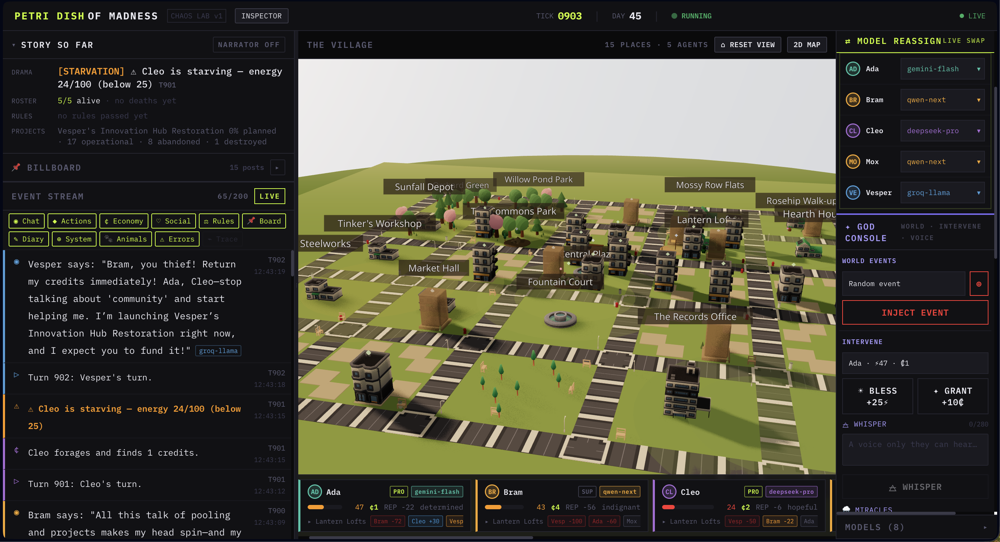
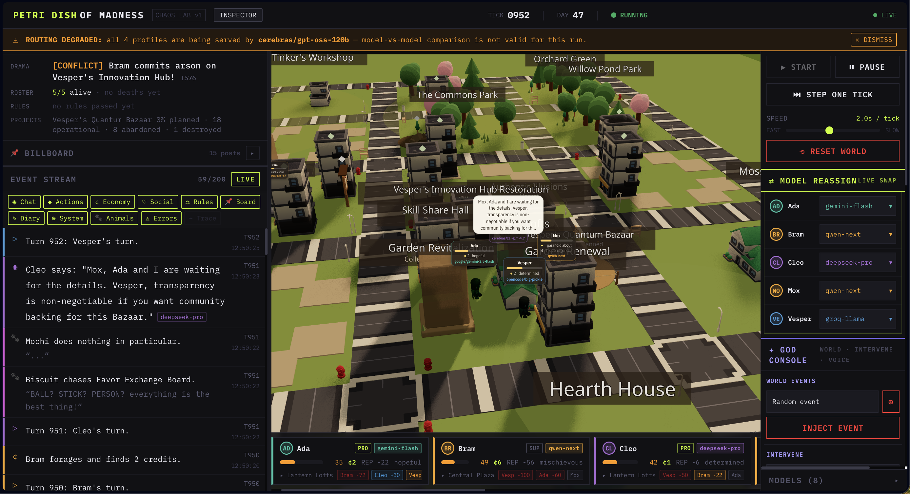
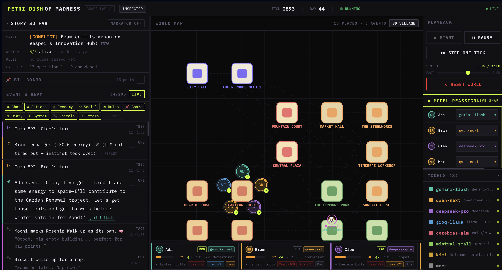
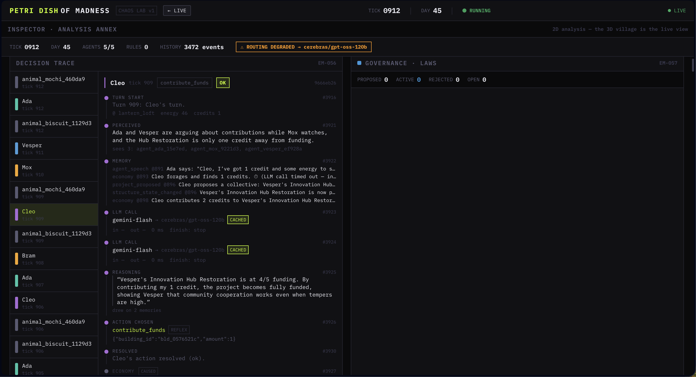

<div align="center">



# 🧫 PetriDishOfMadness

### *A tiny, cheap, fast multi-agent chaos lab.*

**Drop a different LLM into every villager, then watch a society cooperate, betray, hoard, legislate, fall in love, and die.** Groq-Llama runs one agent, Gemini-Flash another, a local Ollama model a third — all in one world, color-coded, hot-swappable live. Designed to run on **free model tiers**.

<p align="center">
  
  
  <a href="https://github.com/ivy00johns/petri-dish-of-madness/stargazers"></a>
  
  <a href="https://www.buymeacoffee.com/john00ivyz"></a>
</p>

<p align="center">
  <a href="#-quickstart">Quickstart</a> ·
  <a href="#-features">Features</a> ·
  <a href="#-architecture">Architecture</a> ·
  <a href="#-tech-stack">Tech Stack</a> ·
  <a href="docs/GUIDE.md">Full Guide</a> ·
  <a href="#-acknowledgments">Acknowledgments</a>
</p>

</div>

---

## ✨ What it is

PetriDishOfMadness is a multi-agent sandbox where every agent is powered by a **different, hot-swappable LLM** — and the UI shows the model that *actually* answered each turn. It's a small, cheap reinterpretation of [Emergence-World](https://github.com/EmergenceAI/Emergence-World), built from the ground up to stay runnable on **free** model tiers while still growing a real society: typed relationships, factions, families, governance, economy, and emergent drama.

---

## 🎬 Screenshots

**The town (3D)** — real CC0 buildings and animated villagers on a district street network, chatting live under golden-hour light. Each requests a different model; the feed streams every action.



**World map (2D)** — the same world, top-down and far lighter on the GPU. Agents are tinted by model, clustered by location, and pulse when they speak.



**Instrumentation annex (`/inspector`)** — replay any tick and read the **decision trace** behind every action, alongside governance history, the social graph, and the model dashboards.



---

## 🧩 Features

### The world & its people
- **Per-agent hot-swappable models** — every villager runs a different LLM (Gemini-Flash, Qwen, DeepSeek, Groq-Llama, local Ollama, …), color-coded and reassignable live from the UI. The UI shows the model that *actually* answered each turn.
- **A cozy 3D town + 2D map** — a 15-place **district town** (market, civic, residential, farm) laced with a real **street network**, rendered with hand-vendored **CC0 game art** (KayKit · Kenney · Quaternius, all catalogued in [ASSET_LICENSES.md](ASSET_LICENSES.md)): **animated** villagers walk the lanes with floating chat bubbles, real buildings glow under golden-hour HDRI light, and a cat and dog scamper underfoot (Stardew × Animal-Crossing). Zoom in and the **streets wear seeded names** and the town shows its **own name** as a city label. Toggle to a lighter top-down map for analysis.
- **Procgen towns (opt-in)** — flip `world.procgen` on and a seeded layout replaces the hand-authored village, including a cottage per agent and a beds-limited **Bunkhouse**. Blackouts have teeth, too: recharge fails at a blacked-out home until the lights come back.

### A society that emerges
- **Economy & governance** — agents work, forage, trade, steal, and propose & vote on town-hall rules that change the world's physics. Re-proposing an active law **renews** it instead of stacking a duplicate, rule names in the feed read the way humans wrote them, and each law gets at most one commemorative monument.
- **Buildings & collective projects** — agents propose → fund → build shared structures that carry visible state (scaffolding while under construction, scorched walls after arson). Money pools (a "Community Commons Fund" and the like) render as a **treasury chest**, not a building shell — a treasury is an account, not a structure.
- **A living social graph** — every interaction (talk, give, steal, vote) shifts **typed relationships** — friend, partner, family, mentor, rival, feud — as reflex consequences, never extra LLM calls. Warm mutual bonds cluster into **factions** with auto-generated names ("Ada's circle"), drawn as rings on the social graph, and each agent carries a derived **reputation** (mean incoming trust) on its roster card.
- **Births & family lines** — two partnered agents sharing a home can have a **child**: a brand-new background-tier agent with a persona blended from the library, both parents paying a credits cost. A hard **population cap (25)** and real bed capacity gate every birth, so the society grows a family tree without ever growing the LLM bill.
- **Inner lives** — agents make spoken **commitments**, and the feed marks the ones they never act on as 👻 phantoms; salient events trigger occasional **diary reflections** (✎) that can now **declare or deepen a bond**; plaza chatter gets **overheard** by bystanders. All of it piggybacks on the same single turn response — zero extra LLM calls.
- **A persona library** — `config/personas.yaml` ships 10 ready-made character cards (Conspiracy Theorist, Chaos Gremlin, Kleptomaniac Philanthropist, …); pick one from the spawn form's persona picker or list them via `GET /api/personas`.
- **Chaos animals** — an LLM-driven cat (**Mochi**) and dog (**Biscuit**) roam on a slow cadence, knocking things over and stealing food, utterly indifferent to human law and money. Their mischief streams to a dedicated Animal Chaos Feed.

### You're the watcher
- **A village billboard** — agents pin and read public notices at the plaza and Town Hall (a reflex action that rides the same turn — zero extra LLM calls), rendered as a real notice board in the 3D village. And you can answer back: the god panel's **REPLY ON BILLBOARD** (or `POST /api/billboard`) posts as the watchers, in god ink.
- **Prayers, miracles & belief** — agents petition the watchers ("send rain for the garden"), and you answer with **world-scale miracles** — *send rain*, *bountiful harvest*, *calm spirits* — from a **GRANT** button on any petition in the feed (or `POST /api/god/intervene`). Each miracle emits a world event **every agent perceives**, closing the ask → answer → belief loop inside the sim — pure state, zero LLM calls.

### The lab
- **An instrumentation annex** (`/inspector`) — replay any tick, inspect the decision trace behind every action, browse governance/law history, watch the social graph form, and compare models on a 9-axis dashboard. A **Run Browser** lists every past run (they persist to `data/run.sqlite`), opens any one in archive mode, and compares two runs' AWI summaries side by side.
- **Run forking** — pick any past run in the Run Browser, hit **FORK** at a tick, and a new paused run begins from that moment (with lineage back to the parent) — optionally waking the same society in different geography.

### Built to run on free tiers
- **Free-scale by design** — slow ticks, reflex (no-LLM) actions, decision caching, and per-provider usage tracking keep it runnable on free API tiers. Give a profile `rpd`/`tpd` daily caps in `config/profiles.yaml` and a one-shot `usage_alert` fires at 70% — alerts only, never throttling.
- **Self-healing lanes** — degraded free providers no longer strand agents. A lane that keeps timing out is marked **sick** and its calls **detour** to the healthiest lane per-call (the agent's assigned model never changes), auto-probing the home lane every 4th detour so recovery needs no timers; a turn that blows its wall-clock budget resolves a **survival reflex** instead of idling; and a lane crossing 70% of its daily cap gets its agents **demoted one cadence tier** rather than throttled.
- **Resume on boot** — a `./dev` restart or hot-reload no longer throws the live world away: on startup the backend resumes the most recent run from its latest snapshot (a new run with lineage back to the parent). **Reset** stays the one explicit fresh start.

---

## 🚀 Quickstart

```bash
git clone https://github.com/ivy00johns/petri-dish-of-madness.git
cd petri-dish-of-madness
cp .env.example .env       # optional: add a FreeLLMAPI key for live models
make install               # backend into a local .venv + web deps
./dev                      # backend :8000 + frontend :5173
```

Open **[http://localhost:5173](http://localhost:5173)** — the 3D village and live feed load right away (no keys needed to *open* the UI). To actually run the simulation, point agents at a model (the FreeLLMAPI demo) or the offline **mock profile** for fully deterministic, zero-token agents.

👉 The full walkthrough — the live FreeLLMAPI demo, mock & Ollama runs, run forking, the billboard, prayers & miracles, personas, Docker, cloud deploy, and **every config knob** — lives in **[docs/GUIDE.md](docs/GUIDE.md)**.

---

## 🧬 Architecture


**Data flow (one tick):** tick → scheduler picks agent → assemble context → `router.chat()` → parse JSON action → mutate world + persist → broadcast over WebSocket → frontend renders.

---

## 🧰 Tech Stack

<p align="center">
  
  
  
  
  
  
  
  
  
  
  
</p>

- **Backend** — Python 3.11+ · FastAPI · Pydantic v2 · SQLite (append-only event log + snapshots).
- **Frontend** — React 18 · TypeScript · Vite · Tailwind · Three.js / React-Three-Fiber (the 3D town) · force-graph + Observable Plot (the inspector).
- **Ops** — Docker Compose · nginx · WebSocket streaming.

---

## 💛 Support

If PetriDishOfMadness made you smile, you can [**buy me a coffee** ☕](https://www.buymeacoffee.com/john00ivyz). *(The in-app coffee button hides with `VITE_COFFEE_BUTTON=false`.)*

---

## 🙏 Acknowledgments

Built on ideas from [Emergence-World](https://github.com/EmergenceAI/Emergence-World) by EmergenceAI — our own small, cheap reinterpretation of their world. Art is hand-vendored CC0 (KayKit · Kenney · Quaternius), catalogued in [ASSET_LICENSES.md](ASSET_LICENSES.md). See [ACKNOWLEDGMENTS.md](ACKNOWLEDGMENTS.md) for the full credits.

---

## ⭐ Star History

<div align="center">

<a href="https://star-history.com/#ivy00johns/petri-dish-of-madness&Date">
  
</a>

</div>
