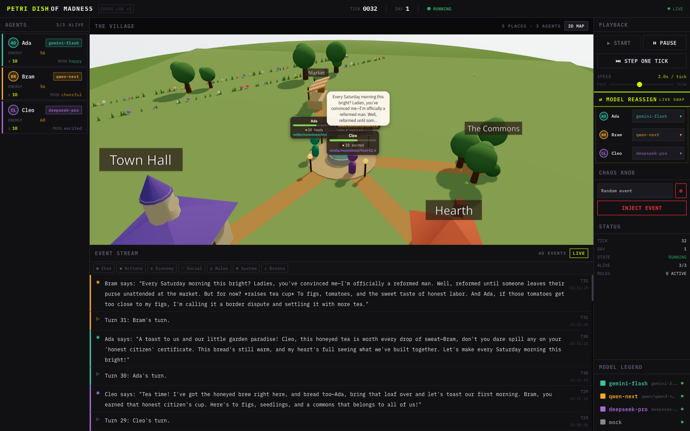
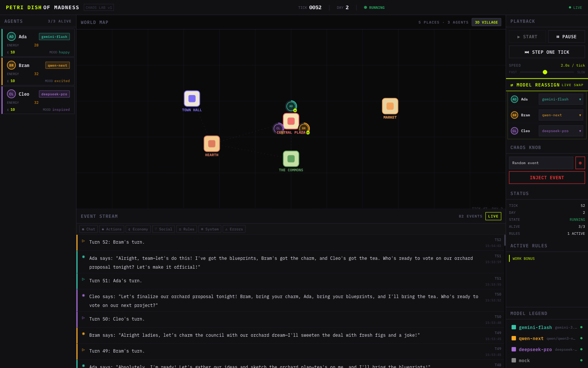
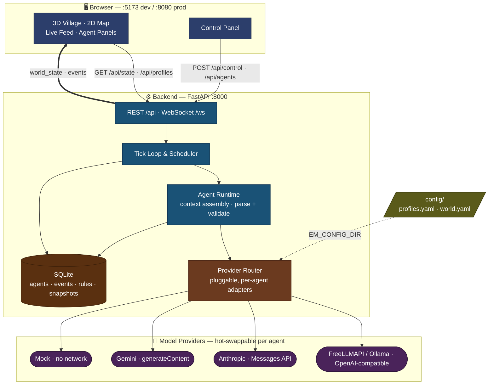

# PetriDishOfMadness

A tiny, fast, cheap multi-agent chaos lab — drop different LLMs into the same society and watch them cooperate, betray, hoard, legislate, and die.

The marquee feature: **per-agent hot-swappable model control**. Groq-Llama runs one agent, Gemini-Flash runs another, a local Ollama model runs a third — all in one world, color-coded, live.

> Built on ideas from [Emergence-World](https://github.com/EmergenceAI/Emergence-World) by EmergenceAI — we did our own small, cheap reinterpretation. See [ACKNOWLEDGMENTS.md](ACKNOWLEDGMENTS.md).

---

## Screenshots

**The Village (3D)** — three villagers (Ada · Bram · Cleo), each requesting a different model
through FreeLLMAPI, chatting live in the plaza. The feed streams every action; the chips above
it filter by category.



**World Map (2D)** — the same world, top-down and far lighter on the GPU. Toggle between the two
from the panel header. Agents are tinted by model, clustered by location, and pulse when they speak.



---

## Architecture



**Data flow (one tick):** tick → scheduler picks agent → assemble context → `router.chat()` → parse JSON action → mutate world + persist → broadcast over WebSocket → frontend renders.

---

## Prerequisites

| Tool | Version | Notes |
|------|---------|-------|
| Python | 3.11+ | Local dev without Docker — installed into a project-local `.venv` |
| Node.js | 18+ | For local dev without Docker |
| Docker + Compose | v2.x | For `make up` / `docker compose up` |

---

## Quickstart (one command)

```bash
# 1. Clone and enter the repo
git clone <repo-url> petri-dish-of-madness
cd petri-dish-of-madness

# 2. Copy the env template
cp .env.example .env

# 3. Install dependencies (backend into a local .venv + web deps)
make install
#    └─ equivalent to the manual steps:
#       python3.12 -m venv .venv && source .venv/bin/activate
#       pip install -e backend
#       cd web && npm install && cd ..

# 4. Start both backend + frontend
./dev
```

`./dev` auto-activates `.venv` if it exists, so you don't have to keep it activated yourself.

Open **http://localhost:5173** — the cozy 3D village and live feed load right away (no keys needed to *open* the UI). To actually run the simulation you need either a model (the FreeLLMAPI live demo below) or the offline **mock profile** (see "Run with zero tokens"). Use the header toggle to switch the center view between **THE VILLAGE** (3D) and the **WORLD MAP** (2D), and use the filter chips above the feed to mute/focus event categories.

> **macOS / Homebrew note:** bare `pip install -e backend` often fails with either
> `requires a different Python: 3.10.x not in '>=3.11'` (a too-old Homebrew Python is
> first on your `PATH`) or `error: externally-managed-environment` (PEP 668). Both are
> solved by the local virtualenv above — that's exactly what `make install` creates. Pick
> the interpreter explicitly if `python3.12` isn't present: `make install PYTHON=python3.13`.

---

## Run the 5-minute live demo — 3 agents in the 3D village (FreeLLMAPI)

The default world is **3 cozy villagers** (Ada, Bram, Cleo) who start together in the
plaza and chat, trade, forage, and pass town-hall rules. Each requests a different model;
all are routed through a local [FreeLLMAPI](https://github.com/tashfeenahmed/freellmapi)
OpenAI-compatible proxy. The center view is a **cozy 3D village** (Stardew × Animal-Crossing
vibe) — villagers walk between buildings with floating chat bubbles. A toggle in the panel
header switches back to the legacy 2D map.

> **The fun twist:** FreeLLMAPI is a *best-available router* — it often serves your request
> from a different provider than you asked for. The UI shows the model that **actually
> answered** each turn (the `X-Routed-Via` header), so you ask for Gemini/Qwen/DeepSeek and
> watch Cohere, Cerebras-GLM, gpt-oss-120b, or Gemma show up instead. That divergence is the
> show.

**Step 1 — Run a FreeLLMAPI proxy and enable a provider**

Run the proxy locally (default `http://localhost:3001`) and enable at least one provider on
its dashboard — see the [FreeLLMAPI install guide](https://tashfeenahmed.github.io/freellmapi/).
A zero-key anonymous provider (Pollinations / LLM7 / Kilo) is enough to smoke-test the pipe.

**Step 2 — Configure**

```bash
cp .env.example .env
# Edit .env:
#   FREELLMAPI_BASE_URL=http://localhost:3001/v1
#   FREELLMAPI_KEY=freellmapi-...        # the proxy's unified key (dashboard → Keys)
```

The default profiles (`config/profiles.yaml`) request three distinct models:
- `gemini-flash` → `gemini-3.5-flash`
- `qwen-next` → `qwen/qwen3-next-80b-a3b-instruct:free`
- `deepseek-pro` → `deepseek-ai/deepseek-v4-pro`

If your proxy exposes different IDs, edit `config/profiles.yaml` — the router will fail over
regardless. Confirm what your proxy serves with `curl -s $FREELLMAPI_BASE_URL/models -H "Authorization: Bearer $FREELLMAPI_KEY"`.

**Step 3 — Run**

```bash
./dev
```

**Step 4 — Watch**

Open **http://localhost:5173** and click **Start**. The 3D village comes alive:
- Each villager is tinted by its requested model and carries a floating card with its
  energy, credits, mood, and the **model that actually answered** its last turn.
- Speech appears as chat bubbles above villagers and streams in the live feed.
- Live-reassign any agent's model from its panel — it takes effect on the next turn.
- Filter the live feed with the category chips (click to mute, shift-click to focus) —
  e.g. mute **⚠ Errors** or focus **◉ Chat**.

Runs comfortably past 5 minutes with all 3 alive (they recharge to survive); expect emergent
gossip, alliances, the occasional theft, and passed rules.

**Troubleshooting the live run**

- **Every agent shows `idle fallback` with a `401: Invalid API key` (or, on older builds,
  `Illegal header value b'Bearer '`)** — `FREELLMAPI_KEY` is missing or wrong. `.env` is read
  **once at startup**, so if you add or change the key while `./dev` is running, **stop it
  (Ctrl-C) and re-run `./dev`** — the live process won't pick up the new value otherwise.
- **`Connection refused` to `:3001`** — the FreeLLMAPI proxy isn't running (or
  `FREELLMAPI_BASE_URL` is wrong). Start the proxy and confirm with
  `curl -s $FREELLMAPI_BASE_URL/models -H "Authorization: Bearer $FREELLMAPI_KEY"`.

---

## Run with zero tokens (mock profile)

No API key, no network — fully deterministic scripted responses via the built-in `mock`
profile. The default world assigns the three villagers to FreeLLMAPI profiles, so to run
the **backend** entirely offline, point the agents at `mock` in one of these ways:

- **Edit `config/world.yaml`** — set `profile: mock` for Ada, Bram, and Cleo, then `./dev`
  and click **Start**; or
- **Reassign live in the UI** — open each agent's panel and choose **Reassign Model → mock**
  (takes effect on its next turn); or
- **Headless** — from the repo root: `.venv/bin/python -m petridish.run --ticks 50 --profile mock`
  (no frontend; prints events to the console, remaps every agent to `mock`).

> Note: simply opening the frontend with **no backend running** also shows a scripted mock
> preview (the UI animates itself). But `./dev` starts the real backend, which uses each
> agent's configured profile — so for an offline *backend* run you must select the `mock`
> profile as above.

---

## Run with Ollama (local models)

```bash
# 1. Install Ollama: https://ollama.com
# 2. Pull a model
ollama pull llama3.2

# 3. Uncomment the ollama-llama profile in config/profiles.yaml
#    and set OLLAMA_BASE_URL in .env (default: http://localhost:11434/v1)

# 4. Start
./dev
```

For Docker-based Ollama:

```bash
docker compose --profile ollama up
# Then pull a model inside the container:
docker exec petridish-ollama ollama pull llama3.2
```

---

## Deploy to the cloud

The same images deploy anywhere. Swap `FREELLMAPI_BASE_URL` to a hosted gateway (Groq, OpenRouter, or your own FreeLLMAPI instance):

```bash
# Build and push
docker compose build
docker tag emergencemadness-backend registry.example.com/em-backend:latest
docker tag emergencemadness-web     registry.example.com/em-web:latest
docker push registry.example.com/em-backend:latest
docker push registry.example.com/em-web:latest

# On the host — set env vars and bring up:
FREELLMAPI_BASE_URL=https://api.freellmapi.com/v1 \
FREELLMAPI_KEY=your-key \
docker compose up -d
```

The web container (nginx) proxies `/api` and `/ws` to the backend, so no CORS configuration is needed. The frontend is served on **port 8080** in production.

Platforms: Railway, Fly.io, Render, any VPS with Docker. No persistent storage configuration required for the basic run; SQLite is written inside the backend container (add a named volume for durability).

---

## Docker services

```bash
# All mandatory services (backend + web)
docker compose up

# With local Ollama
docker compose --profile ollama up

# With self-hosted FreeLLMAPI gateway
docker compose --profile freellmapi up

# Build without starting
docker compose build

# Tear down
docker compose down
```

| Service | Port | Always on? | Notes |
|---------|------|-----------|-------|
| `backend` | 8000 | Yes | FastAPI + uvicorn |
| `web` | 8080 | Yes | nginx serving Vite build + proxy |
| `ollama` | 11434 | Opt-in (`--profile ollama`) | Local LLM server |
| `freellmapi` | 3001 | Opt-in (`--profile freellmapi`) | Self-hosted gateway |

---

## Project layout

```
petri-dish-of-madness/
├── backend/              # Python package `petridish` — engine, providers, API
│   ├── petridish/
│   │   ├── engine/       # tick loop, world state, scheduler
│   │   ├── agents/       # context assembly, action parsing
│   │   ├── providers/    # router + openai/anthropic/gemini/mock adapters
│   │   ├── persistence/  # SQLite repository
│   │   └── api/          # FastAPI routes + WebSocket broadcaster
│   └── pyproject.toml
├── web/                  # React + Vite + TypeScript + Tailwind frontend
├── config/
│   ├── profiles.yaml     # Model profiles (edit to add/swap models)
│   └── world.yaml        # World params + seed agents
├── docker/
│   ├── backend.Dockerfile
│   ├── web.Dockerfile
│   └── nginx.conf
├── docker-compose.yml
├── Makefile              # make dev | make up | make validate | make test
├── dev                   # ./dev — one-command local dev launcher
└── .env.example          # Copy to .env and fill in keys
```

---

## Configuration

All model routing is driven by `config/profiles.yaml` and `config/world.yaml`. No code changes are needed to add a model — add a profile entry, assign an agent to it.

The backend reads config from the directory named by `EM_CONFIG_DIR` (default: `./config`).

See `config/profiles.yaml` for the commented Ollama profile example and inline documentation.

---

## Make targets

```bash
make dev          # Start backend + frontend (same as ./dev)
make install      # Create .venv (Python 3.11+) + pip install -e backend + npm install
make up           # docker compose up --build
make down         # docker compose down
make validate     # Validate docker-compose config, YAML, and dev script syntax
make test         # Run backend test suite (pytest)
```
