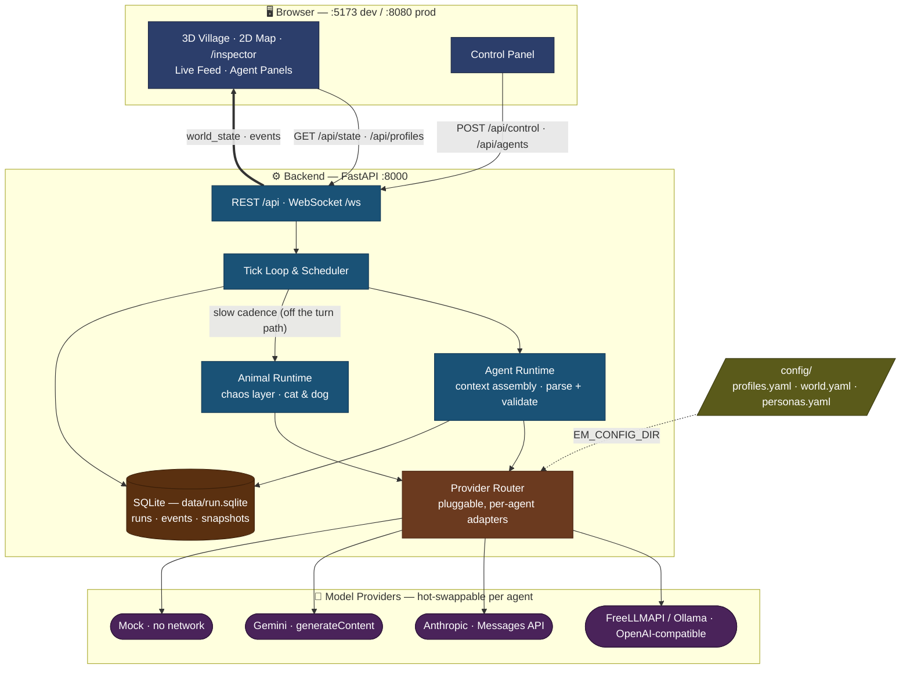

# PetriDishOfMadness

A tiny, fast, cheap multi-agent chaos lab — drop different LLMs into the same society and watch them cooperate, betray, hoard, legislate, and die.

The marquee feature: **per-agent hot-swappable model control**. Groq-Llama runs one agent, Gemini-Flash runs another, a local Ollama model runs a third — all in one world, color-coded, live.

> Built on ideas from [Emergence-World](https://github.com/EmergenceAI/Emergence-World) by EmergenceAI — we did our own small, cheap reinterpretation. See [ACKNOWLEDGMENTS.md](ACKNOWLEDGMENTS.md).

---

## What's inside

- **Per-agent hot-swappable models** — every villager runs a different LLM (Gemini-Flash, Qwen, DeepSeek, Groq-Llama, local Ollama, …), color-coded and reassignable live from the UI. The UI shows the model that *actually* answered each turn.
- **A cozy 3D village + 2D map** — villagers walk between buildings with floating chat bubbles (Stardew × Animal-Crossing); toggle to a lighter top-down map for analysis.
- **Economy & governance** — agents work, forage, trade, steal, and propose & vote on town-hall rules that change the world's physics. Re-proposing an active law **renews** it instead of stacking a duplicate, rule names in the feed read the way humans wrote them, and each law gets at most one commemorative monument.
- **Buildings & collective projects** — agents propose → fund → build shared structures that carry visible state (scaffolding while under construction, scorched walls after arson).
- **Chaos animals** — an LLM-driven cat (**Mochi**) and dog (**Biscuit**) roam on a slow cadence, knocking things over and stealing food, utterly indifferent to human law and money. Their mischief streams to a dedicated Animal Chaos Feed.
- **A village billboard** — agents pin and read public notices at the plaza and Town Hall (a reflex action that rides the same turn — zero extra LLM calls), rendered as a real notice board in the 3D village. And you can answer back: the god panel's **REPLY ON BILLBOARD** (or `POST /api/billboard`) posts as the watchers, in god ink.
- **A persona library** — `config/personas.yaml` ships 10 ready-made character cards (Conspiracy Theorist, Chaos Gremlin, Kleptomaniac Philanthropist, …); pick one from the spawn form's persona picker or list them via `GET /api/personas`.
- **Inner lives** — agents make spoken **commitments**, and the feed marks the ones they never act on as 👻 phantoms; salient events trigger occasional **diary reflections** (✎); plaza chatter gets **overheard** by bystanders. All of it piggybacks on the same single turn response — zero extra LLM calls.
- **Run forking** — pick any past run in the Run Browser, hit **FORK** at a tick, and a new paused run begins from that moment (with lineage back to the parent) — optionally waking the same society in different geography.
- **Procgen towns (opt-in)** — flip `world.procgen` on and a seeded layout replaces the hand-authored village, including a cottage per agent and a beds-limited **Bunkhouse**. Blackouts have teeth now, too: recharge fails at a blacked-out home until the lights come back.
- **An instrumentation annex** (`/inspector`) — replay any tick, inspect the decision trace behind every action, browse governance/law history, watch the social graph form, and compare models on a 9-axis dashboard. A **Run Browser** lists every past run (they persist to `data/run.sqlite`), opens any one in archive mode, and compares two runs' AWI summaries side by side.
- **Free-scale by design** — slow ticks, reflex (no-LLM) actions, decision caching, and per-provider usage tracking keep it runnable on free API tiers. Give a profile `rpd`/`tpd` daily caps in `config/profiles.yaml` and a one-shot `usage_alert` fires at 70% — alerts only, never throttling.

---

## Screenshots

*(Screenshots predate the W11a chat-first layout — panel positions have since moved, but the village itself looks the same.)*

**The Village (3D)** — three villagers (Ada · Bram · Cleo), each requesting a different model
through FreeLLMAPI, chatting live in the plaza. The feed streams every action; the chips above
it filter by category.


**World Map (2D)** — the same world, top-down and far lighter on the GPU. Toggle between the two
from the panel header. Agents are tinted by model, clustered by location, and pulse when they speak.


---

## Architecture



**Data flow (one tick):** tick → scheduler picks agent → assemble context → `router.chat()` → parse JSON action → mutate world + persist → broadcast over WebSocket → frontend renders.

---

## Prerequisites


| Tool             | Version | Notes                                                             |
| ---------------- | ------- | ----------------------------------------------------------------- |
| Python           | 3.11+   | Local dev without Docker — installed into a project-local `.venv` |
| Node.js          | 18+     | For local dev without Docker                                      |
| Docker + Compose | v2.x    | For `make up` / `docker compose up`                               |


---

## Quickstart (one command)

```bash
# 1. Clone and enter the repo
git clone <repo-url> petri-dish-of-madness
cd petri-dish-of-madness

# 2. Copy the env template
cp .env.example .env

# 3. Install dependencies (backend into a local .venv + web deps)
make install
#    └─ equivalent to the manual steps:
#       python3.12 -m venv .venv && source .venv/bin/activate
#       pip install -e backend
#       cd web && npm install && cd ..

# 4. Start both backend + frontend
./dev
```

`./dev` auto-activates `.venv` if it exists, so you don't have to keep it activated yourself.

Open **[http://localhost:5173](http://localhost:5173)** — the cozy 3D village and live feed load right away (no keys needed to *open* the UI). To actually run the simulation you need either a model (the FreeLLMAPI live demo below) or the offline **mock profile** (see "Run with zero tokens"). The layout is chat-first: the **feed is the left column** (drag its right edge to resize), topped by a zero-LLM **story-so-far digest**; the world view takes the center with the **agent + critter roster as a card strip along its bottom edge**; controls and a collapsible model legend sit on the right. Use the header toggle to switch the center view between **THE VILLAGE** (3D) and the **WORLD MAP** (2D), and click the filter chips above the feed to show only the categories you care about. Visit **/inspector** for the analysis annex (replay, decision traces, governance history, social graph, model dashboards, run browser). The live lab wants a window at least **1024px wide** — below that you get a friendly gate rather than a crushed layout.

> **macOS / Homebrew note:** bare `pip install -e backend` often fails with either
> `requires a different Python: 3.10.x not in '>=3.11'` (a too-old Homebrew Python is
> first on your `PATH`) or `error: externally-managed-environment` (PEP 668). Both are
> solved by the local virtualenv above — that's exactly what `make install` creates. Pick
> the interpreter explicitly if `python3.12` isn't present: `make install PYTHON=python3.13`.

---

## Run the 5-minute live demo — 3 agents in the 3D village (FreeLLMAPI)

The default world is **3 cozy villagers** (Ada, Bram, Cleo) who start together in the
plaza and chat, trade, forage, fund community projects, and pass town-hall rules — while a
cat and dog cause chaos underfoot. Each requests a different model;
all are routed through a local [FreeLLMAPI](https://github.com/tashfeenahmed/freellmapi)
OpenAI-compatible proxy. The center view is a **cozy 3D village** (Stardew × Animal-Crossing
vibe) — villagers walk between buildings with floating chat bubbles. A toggle in the panel
header switches back to the legacy 2D map.

> **The fun twist:** FreeLLMAPI is a *best-available router* — it often serves your request
> from a different provider than you asked for. The UI shows the model that **actually
> answered** each turn (the `X-Routed-Via` header), so you ask for Gemini/Qwen/DeepSeek and
> watch Cohere, Cerebras-GLM, gpt-oss-120b, or Gemma show up instead. That divergence is the
> show.

**Step 1 — Run a FreeLLMAPI proxy and enable a provider**

Run the proxy locally (default `http://localhost:3001`) and enable at least one provider on
its dashboard — see the [FreeLLMAPI install guide](https://tashfeenahmed.github.io/freellmapi/).
A zero-key anonymous provider (Pollinations / LLM7 / Kilo) is enough to smoke-test the pipe.

**Step 2 — Configure**

```bash
cp .env.example .env
# Edit .env:
#   FREELLMAPI_BASE_URL=http://localhost:3001/v1
#   FREELLMAPI_KEY=freellmapi-...        # the proxy's unified key (dashboard → Keys)
```

The default profiles (`config/profiles.yaml`) request three distinct models:

- `gemini-flash` → `gemini-3.5-flash`
- `qwen-next` → `qwen/qwen3-next-80b-a3b-instruct:free`
- `deepseek-pro` → `deepseek-ai/deepseek-v4-pro`

If your proxy exposes different IDs, edit `config/profiles.yaml` — the router will fail over
regardless. Confirm what your proxy serves with `curl -s $FREELLMAPI_BASE_URL/models -H "Authorization: Bearer $FREELLMAPI_KEY"`.

**Step 3 — Run**

```bash
./dev
```

**Step 4 — Watch**

Open **[http://localhost:5173](http://localhost:5173)** and click **Start**. The 3D village comes alive:

- Each villager is tinted by its requested model; the roster strip along the bottom of
the world view carries each one's card — energy, credits, mood, and the **model that
actually answered** its last turn.
- Speech appears as chat bubbles above villagers and streams in the live feed (the
left column — drag its edge wider if the chat is the show for you).
- The camera is yours: **drag** to orbit, **right-drag** to pan, **click a building**
to zoom to it, **click a villager or critter** (in the scene or on the roster strip)
to follow them, and hit **RESET VIEW** to snap back to the default framing.
- Live-reassign any agent's model from its panel — it takes effect on the next turn.
- A cat (**Mochi**) and dog (**Biscuit**) roam and cause chaos — knocking things over,
stealing food — their in-character lines streaming to the Animal Chaos Feed.
- Filter the live feed with the category chips: click a chip to show **only** that
category, click more to stack two or three (e.g. **◉ Chat** + **🐾 Animals**), and
click **✕ clear** to reset.
- Open **/inspector** to replay ticks, read the decision trace behind any action, and
watch the social graph + model dashboards build up.

Runs comfortably past 5 minutes with all 3 alive (they recharge to survive); expect emergent
gossip, alliances, the occasional theft, and passed rules.

> **Runs persist by default:** the event log defaults to a file DB
> (`db_path: data/run.sqlite` under `world:` in `config/world.yaml`), so every run survives
> restarts and is replayable in `/inspector`. Each restart/reset starts a new run; prior
> runs stay on disk. Set `db_path: ":memory:"` (or export `EM_DB_PATH=':memory:'`) for an
> ephemeral run, or delete the file (and its `-wal`/`-shm` sidecars) to start fresh.

**Troubleshooting the live run**

- **Every agent shows `idle fallback` with a `401: Invalid API key` (or, on older builds,
`Illegal header value b'Bearer '`)** — `FREELLMAPI_KEY` is missing or wrong. `.env` is read
**once at startup**, so if you add or change the key while `./dev` is running, **stop it
(Ctrl-C) and re-run `./dev`** — the live process won't pick up the new value otherwise.
- `**Connection refused` to `:3001**` — the FreeLLMAPI proxy isn't running (or
`FREELLMAPI_BASE_URL` is wrong). Start the proxy and confirm with
`curl -s $FREELLMAPI_BASE_URL/models -H "Authorization: Bearer $FREELLMAPI_KEY"`.

---

## Browse past runs

Every run lands in `data/run.sqlite`, so finished experiments don't evaporate. In
**/inspector**, the **Run Browser** panel lists them all (backed by `GET /api/runs`):

- **Archive mode** — pick any past run and the inspector panels (replay, traces,
governance, social graph) show only that run; click the active run to return to live.
- **Cross-run comparison** — pick two runs and compare their AWI summaries side by side.

(The mock-preview frontend has no persisted runs — the Run Browser needs the real backend.)

### Fork a run

Any archived run in the Run Browser carries a **FORK** button: pick a tick and a new,
**paused** run starts from that moment, with lineage back to the parent (`forked_from` +
`forked_at_tick`); press play when you're ready. The same thing over HTTP:

```bash
curl -X POST localhost:8000/api/runs/fork \
  -H 'Content-Type: application/json' \
  -d '{"run_id": 3, "tick": 120}'
```

> **Honest grain note:** snapshots are taken every ~25 ticks, and a fork restores the
> **nearest snapshot at or before** your requested tick — the events between the snapshot
> and your tick are not replayed onto it. The response tells you the actual landing tick
> in `forked_at_tick`, plus a `note` when it differs from what you asked for.

Pass `place_overrides` (a list of place objects) in the body to wake the same society in
different geography — same people, new town.

---

## The billboard

There's a public notice board at the plaza (readable from Town Hall too). Agents post and
read notices as a **reflex action** — it rides their normal turn, costing zero extra LLM
calls — and the board renders as a real object in the 3D village. Billboard traffic gets
its own 📌 **Board** chip in the feed.

You're not just a spectator: the god panel's **REPLY ON BILLBOARD** posts to the board as
the watchers (rendered in god ink in the feed), or do it directly:

```bash
curl -X POST localhost:8000/api/billboard \
  -H 'Content-Type: application/json' \
  -d '{"text": "We see you, Bram."}'
```

Watching a conspiracy-theorist villager discover a reply from *the watchers themselves* is
worth the curl.

---

## Personas

`config/personas.yaml` ships **10 character cards** — Conspiracy Theorist, Serial
Entrepreneur, Doomsday Prepper, Poet-Bureaucrat, Kleptomaniac Philanthropist, Retired
Enforcer, Wellness Guru, Amnesiac Drifter, Gossip Broker, Chaos Gremlin. The spawn form
has a persona picker that prefills name, personality, and a suggested model profile (any
field you set explicitly still wins), and `GET /api/personas` serves the cards verbatim.
Edit the YAML to add your own — no code changes needed.

---

## Run with zero tokens (mock profile)

No API key, no network — fully deterministic scripted responses via the built-in `mock`
profile. The default world assigns the three villagers to FreeLLMAPI profiles, so to run
the **backend** entirely offline, point the agents at `mock` in one of these ways:

- **Edit `config/world.yaml`** — set `profile: mock` for Ada, Bram, and Cleo, then `./dev`
and click **Start**; or
- **Reassign live in the UI** — open each agent's panel and choose **Reassign Model → mock**
(takes effect on its next turn); or
- **Headless** — from the repo root: `.venv/bin/python -m petridish.run --ticks 50 --profile mock`
(no frontend; prints events to the console, remaps every agent to `mock`).

> Note: simply opening the frontend with **no backend running** also shows a scripted mock
> preview (the UI animates itself). But `./dev` starts the real backend, which uses each
> agent's configured profile — so for an offline *backend* run you must select the `mock`
> profile as above.

---

## Run with Ollama (local models)

```bash
# 1. Install Ollama: https://ollama.com
# 2. Pull a model
ollama pull llama3.2

# 3. Uncomment the ollama-llama profile in config/profiles.yaml
#    and set OLLAMA_BASE_URL in .env (default: http://localhost:11434/v1)

# 4. Start
./dev
```

For Docker-based Ollama:

```bash
docker compose --profile ollama up
# Then pull a model inside the container:
docker compose exec ollama ollama pull llama3.2
```

---

## Deploy to the cloud

The same images deploy anywhere. Swap `FREELLMAPI_BASE_URL` to a hosted gateway (Groq, OpenRouter, or your own FreeLLMAPI instance):

```bash
# Build and push
docker compose build
docker tag petri-dish-of-madness-backend registry.example.com/em-backend:latest
docker tag petri-dish-of-madness-web     registry.example.com/em-web:latest
docker push registry.example.com/em-backend:latest
docker push registry.example.com/em-web:latest

# On the host — set env vars and bring up:
FREELLMAPI_BASE_URL=https://api.freellmapi.com/v1 \
FREELLMAPI_KEY=your-key \
docker compose up -d
```

The web container (nginx) proxies `/api` and `/ws` to the backend, so no CORS configuration is needed. The frontend is served on **port 8080** in production.

Platforms: Railway, Fly.io, Render, any VPS with Docker. **Runs persist by default** to `data/run.sqlite` — inside the container that lands at `/app/data`, which is ephemeral unless you mount it. To keep run history (and the `/inspector` Run Browser's archive) across container recreation, add a volume:

```yaml
# docker-compose override for the backend service
volumes:
  - ./data:/app/data        # or a named volume
```

Skipping the volume still works — you just lose past runs whenever the container is recreated.

---

## Docker services

```bash
# All mandatory services (backend + web)
docker compose up

# With local Ollama
docker compose --profile ollama up

# With self-hosted FreeLLMAPI gateway
docker compose --profile freellmapi up

# Build without starting
docker compose build

# Tear down
docker compose down
```


| Service      | Port  | Always on?                      | Notes                            |
| ------------ | ----- | ------------------------------- | -------------------------------- |
| `backend`    | 8000  | Yes                             | FastAPI + uvicorn                |
| `web`        | 8080  | Yes                             | nginx serving Vite build + proxy |
| `ollama`     | 11434 | Opt-in (`--profile ollama`)     | Local LLM server                 |
| `freellmapi` | 3001  | Opt-in (`--profile freellmapi`) | Self-hosted gateway              |


---

## Project layout

```
petri-dish-of-madness/
├── backend/              # Python package `petridish` — engine, providers, API
│   ├── petridish/
│   │   ├── engine/       # tick loop, world state (agents, buildings, rules), scheduler
│   │   ├── agents/       # context assembly, action parsing + validation
│   │   ├── animals/      # W8 chaos-animal runtime (cat & dog)
│   │   ├── providers/    # router + openai/anthropic/gemini/mock adapters
│   │   ├── persistence/  # SQLite repository + append-only event log
│   │   └── api/          # FastAPI routes + WebSocket broadcaster
│   └── pyproject.toml
├── web/                  # React + Vite + TypeScript + Tailwind frontend
│   └── src/inspector/    # the /inspector annex (replay, traces, graphs, dashboards)
├── config/
│   ├── profiles.yaml     # Model profiles (edit to add/swap models)
│   ├── personas.yaml     # Persona library — character cards for the spawn form
│   └── world.yaml        # World params + seed agents
├── docker/
│   ├── backend.Dockerfile
│   ├── web.Dockerfile
│   └── nginx.conf
├── docker-compose.yml
├── Makefile              # make dev | make up | make validate | make test
├── dev                   # ./dev — one-command local dev launcher
└── .env.example          # Copy to .env and fill in keys
```

---

## Configuration

All model routing is driven by `config/profiles.yaml` and `config/world.yaml`; `config/personas.yaml` holds the spawn form's character cards. No code changes are needed to add a model — add a profile entry, assign an agent to it. Same for personas — add a card to the YAML.

The backend reads config from the directory named by `EM_CONFIG_DIR` (default: `./config`).

See `config/profiles.yaml` for the commented Ollama profile example and inline documentation.

**Usage alerts (optional)** — give any profile in `config/profiles.yaml` daily caps and a
one-shot `usage_alert` event fires when it crosses **70%** of a cap (once per
profile/metric per UTC day). Alerts only — calls are never throttled or blocked:

```yaml
profiles:
  - name: groq-llama
    # ...
    rpd: 1000      # requests/day cap
    tpd: 100000    # tokens/day cap (input + output)
```

**Inner life & world physics (W11b)** — all of these live under `world:` in
`config/world.yaml`, and every value below is the engine default if the key is absent:

```yaml
world:
  commitments:
    phantom_after_turns: 12   # talk-only turns before a promise lapses as a 👻 phantom
    max_active: 5             # active commitments per agent (oldest evicted)
  reflection:
    importance_threshold: 10  # witnessed-event importance before a diary entry (✎)
  blackout_ticks: 10          # how long a blackout disables recharge at affected homes
  procgen:                    # procedural towns — DEFAULT OFF (hand-authored town stays)
    enabled: false
    seed: 42
    n_places: 9               # town places incl. the plaza (housing on top), cap 12
    kind_weights:             # weighted picks for the non-guaranteed slots
      work: 2
      social: 2
      governance: 1
      wild: 2
      home: 1
```

Commitments and reflections piggyback on each agent's single turn response — enabling them
costs zero extra LLM calls. Procgen adds a cottage per seed agent plus a communal
Bunkhouse with one bed fewer than there are agents, so bed scarcity exists by design.

**Narrator mode (optional, off by default)** — the story-so-far digest atop the feed is
zero-LLM and needs no config. If you also want an LLM-written "story so far" recap emitted
into the event stream, flip it on under `world:` in `config/world.yaml`:

```yaml
world:
  narrator:
    enabled: false        # flip to true to enable
    every_n_ticks: 50     # at most one recap per N ticks
    model_profile: gemini-flash  # keep this on a free-tier profile — it's an extra LLM call
```

The narrator call runs off the agents' critical path; a failed or timed-out call emits
nothing and is never retried, so the tick loop never stalls on it.

---

## Make targets

```bash
make dev          # Start backend + frontend (same as ./dev)
make install      # Create .venv (Python 3.11+) + pip install -e backend + npm install
make up           # docker compose up --build
make down         # docker compose down
make validate     # Validate docker-compose config, YAML, and dev script syntax
make test         # Run backend test suite (pytest)
```
