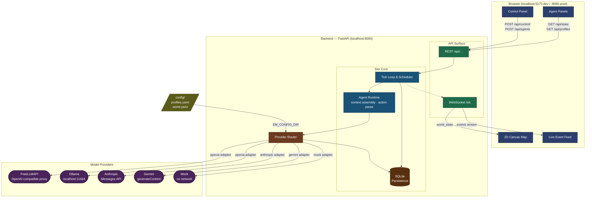

# EmergenceMadness

A tiny, fast, cheap multi-agent chaos lab — drop different LLMs into the same society and watch them cooperate, betray, hoard, legislate, and die.

The marquee feature: **per-agent hot-swappable model control**. Groq-Llama runs one agent, Gemini-Flash runs another, a local Ollama model runs a third — all in one world, color-coded, live.

---

## Architecture



**Data flow (one tick):** tick → scheduler picks agent → assemble context → `router.chat()` → parse JSON action → mutate world + persist → broadcast over WebSocket → frontend renders.

---

## Prerequisites

| Tool | Version | Notes |
|------|---------|-------|
| Python | 3.11+ | For local dev without Docker |
| Node.js | 18+ | For local dev without Docker |
| Docker + Compose | v2.x | For `make up` / `docker compose up` |

---

## Quickstart (one command)

```bash
# 1. Clone and enter the repo
git clone <repo-url> EmergenceMadness
cd EmergenceMadness

# 2. Copy the env template
cp .env.example .env

# 3. Install dependencies
pip install -e backend
cd web && npm install && cd ..

# 4. Start both backend + frontend
./dev
```

Open **http://localhost:5173** — the 2D map and live feed will load immediately in mock mode (no API keys required).

---

## Run the 5-minute 2-model demo (FreeLLMAPI)

Runs 5 agents split across `groq-llama` (Llama 3.3 70B) and `gemini-flash` (Gemini 2.0 Flash), routed through [FreeLLMAPI](https://freellmapi.com)'s free OpenAI-compatible proxy (~1.3B tokens/month free).

**Step 1 — Get a FreeLLMAPI key**

Sign up at https://freellmapi.com and copy your API key.

**Step 2 — Configure**

```bash
cp .env.example .env
# Edit .env:
#   FREELLMAPI_KEY=your-key-here
#   FREELLMAPI_BASE_URL=https://api.freellmapi.com/v1   # or the URL from your dashboard
```

**Step 3 — Confirm the model IDs are active**

The default profiles use:
- `groq-llama` → model `llama-3.3-70b-versatile`
- `gemini-flash` → model `gemini-2.0-flash`

Both are available on FreeLLMAPI. If a model has been renamed in your gateway, update `config/profiles.yaml` accordingly.

**Step 4 — Run**

```bash
./dev
```

**Step 5 — Watch**

Open **http://localhost:5173**, click **Start**. Each agent badge is color-coded by model:
- Red badge = `groq-llama` (Llama 3.3 70B)
- Blue badge = `gemini-flash` (Gemini 2.0 Flash)

Live-reassign any agent's model from its panel. The change takes effect on the next tick.

---

## Run with zero tokens (mock profile)

No API key, no network — fully deterministic scripted responses.

```bash
# Leave FREELLMAPI_KEY blank in .env (or omit .env entirely)
./dev
# Open http://localhost:5173 → Start
```

To assign an agent to the mock profile, use the **Reassign Model** control in the agent panel, or edit `config/world.yaml` to set any agent's `profile: mock` before starting.

---

## Run with Ollama (local models)

```bash
# 1. Install Ollama: https://ollama.com
# 2. Pull a model
ollama pull llama3.2

# 3. Uncomment the ollama-llama profile in config/profiles.yaml
#    and set OLLAMA_BASE_URL in .env (default: http://localhost:11434/v1)

# 4. Start
./dev
```

For Docker-based Ollama:

```bash
docker compose --profile ollama up
# Then pull a model inside the container:
docker exec emergence-ollama ollama pull llama3.2
```

---

## Deploy to the cloud

The same images deploy anywhere. Swap `FREELLMAPI_BASE_URL` to a hosted gateway (Groq, OpenRouter, or your own FreeLLMAPI instance):

```bash
# Build and push
docker compose build
docker tag emergencemadness-backend registry.example.com/em-backend:latest
docker tag emergencemadness-web     registry.example.com/em-web:latest
docker push registry.example.com/em-backend:latest
docker push registry.example.com/em-web:latest

# On the host — set env vars and bring up:
FREELLMAPI_BASE_URL=https://api.freellmapi.com/v1 \
FREELLMAPI_KEY=your-key \
docker compose up -d
```

The web container (nginx) proxies `/api` and `/ws` to the backend, so no CORS configuration is needed. The frontend is served on **port 8080** in production.

Platforms: Railway, Fly.io, Render, any VPS with Docker. No persistent storage configuration required for the basic run; SQLite is written inside the backend container (add a named volume for durability).

---

## Docker services

```bash
# All mandatory services (backend + web)
docker compose up

# With local Ollama
docker compose --profile ollama up

# With self-hosted FreeLLMAPI gateway
docker compose --profile freellmapi up

# Build without starting
docker compose build

# Tear down
docker compose down
```

| Service | Port | Always on? | Notes |
|---------|------|-----------|-------|
| `backend` | 8000 | Yes | FastAPI + uvicorn |
| `web` | 8080 | Yes | nginx serving Vite build + proxy |
| `ollama` | 11434 | Opt-in (`--profile ollama`) | Local LLM server |
| `freellmapi` | 3001 | Opt-in (`--profile freellmapi`) | Self-hosted gateway |

---

## Project layout

```
EmergenceMadness/
├── backend/              # Python package `emergence` — engine, providers, API
│   ├── emergence/
│   │   ├── engine/       # tick loop, world state, scheduler
│   │   ├── agents/       # context assembly, action parsing
│   │   ├── providers/    # router + openai/anthropic/gemini/mock adapters
│   │   ├── persistence/  # SQLite repository
│   │   └── api/          # FastAPI routes + WebSocket broadcaster
│   └── pyproject.toml
├── web/                  # React + Vite + TypeScript + Tailwind frontend
├── config/
│   ├── profiles.yaml     # Model profiles (edit to add/swap models)
│   └── world.yaml        # World params + seed agents
├── docker/
│   ├── backend.Dockerfile
│   ├── web.Dockerfile
│   └── nginx.conf
├── docker-compose.yml
├── Makefile              # make dev | make up | make validate | make test
├── dev                   # ./dev — one-command local dev launcher
└── .env.example          # Copy to .env and fill in keys
```

---

## Configuration

All model routing is driven by `config/profiles.yaml` and `config/world.yaml`. No code changes are needed to add a model — add a profile entry, assign an agent to it.

The backend reads config from the directory named by `EM_CONFIG_DIR` (default: `./config`).

See `config/profiles.yaml` for the commented Ollama profile example and inline documentation.

---

## Make targets

```bash
make dev          # Start backend + frontend (same as ./dev)
make install      # pip install -e backend + cd web && npm install
make up           # docker compose up --build
make down         # docker compose down
make validate     # Validate docker-compose config, YAML, and dev script syntax
make test         # Run backend test suite (pytest)
```
